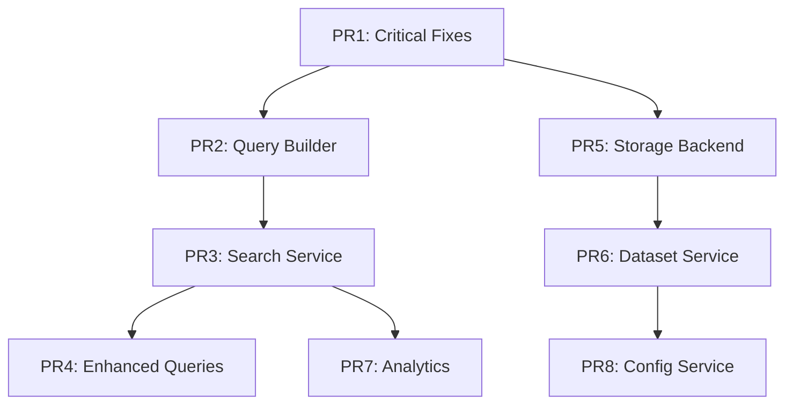

# Domain-Driven Design Milestone Breakdown

## Current State Analysis

### Monolithic Structure Issues
The current implementation has all search logic consolidated in `storage/sqlite_storage.py` (1000+ lines):
- Database connection management
- Schema creation and migrations
- Search query building
- Search execution
- Result formatting
- Dataset management
- Git integration
- Configuration management

### Domain Boundaries Identified

1. **Search Domain**
   - Query parsing and building
   - Search execution strategies
   - Result ranking and formatting
   - Search analytics

2. **Storage Domain**
   - Database connection management
   - Schema management
   - Data persistence operations
   - Transaction handling

3. **Dataset Domain**
   - Dataset lifecycle management
   - Dataset metadata operations
   - Dataset synchronization
   - Worktree handling

4. **Documentation Domain**
   - File documentation CRUD
   - Content indexing
   - Documentation updates

5. **Configuration Domain**
   - Project configuration
   - Git hooks management
   - Settings persistence

## Milestone Breakdown: Search Improvements with DDD Refactoring

### PR 1: Critical Bug Fixes (Immediate)
**Size: Small | Risk: Low | Value: High**

#### Changes:
1. Fix snippet column bug in `search_files()` (lines 475, 489)
   - Change `snippet(files_fts, 2, ...)` to `snippet(files_fts, -1, ...)`
2. Unify query processing in `search_full_content()` (line 553)
   - Replace manual sanitization with `self._build_fts5_query(query)`

#### Files Modified:
- `storage/sqlite_storage.py` (2 line changes)

#### Testing:
- Verify "execution log" returns relevant snippets
- Test existing searches still work

---

### PR 2: Extract Search Query Builder
**Size: Medium | Risk: Low | Value: High**

#### New File Structure:
```
search/
├── __init__.py
├── query_builder.py      # FTS5QueryBuilder class
└── query_strategies.py   # Different query building strategies
```

#### `search/query_builder.py`:
```python
class FTS5QueryBuilder:
    """Builds optimized FTS5 queries with operator preservation."""
    
    def __init__(self, preserve_operators: bool = True):
        self.preserve_operators = preserve_operators
    
    def build_query(self, user_query: str) -> str:
        """Main entry point for query building."""
        
    def _handle_single_word(self, word: str) -> str:
        """Process single word queries with special character preservation."""
        
    def _handle_multi_word(self, words: List[str]) -> str:
        """Build intelligent multi-word queries."""
        
    def _build_fallback_query(self, query: str) -> str:
        """Build safe fallback query for error recovery."""
```

#### Changes:
- Extract `_build_fts5_query()` method from `sqlite_storage.py`
- Create proper abstraction with strategies
- Add comprehensive tests

---

### PR 3: Extract Search Service
**Size: Large | Risk: Medium | Value: High**

#### New File Structure:
```
search/
├── search_service.py     # Main search orchestration
├── search_executor.py    # Query execution logic
└── result_formatter.py   # Result formatting and ranking
```

#### `search/search_service.py`:
```python
class SearchService:
    """Orchestrates search operations across datasets."""
    
    def __init__(self, storage_backend, query_builder):
        self.storage = storage_backend
        self.query_builder = query_builder
        self.executor = SearchExecutor(storage_backend)
        self.formatter = ResultFormatter()
    
    def search_metadata(self, query: str, dataset: str, limit: int) -> SearchResults:
        """Search file metadata (formerly search_files)."""
        
    def search_content(self, query: str, dataset: str, limit: int) -> SearchResults:
        """Search full file content."""
        
    def unified_search(self, query: str, dataset: str, limit: int) -> UnifiedSearchResults:
        """Combined metadata and content search."""
```

#### Migration Strategy:
1. Create new search module alongside existing code
2. Implement SearchService using existing storage methods
3. Update MCP tools to use SearchService
4. Remove old search methods from sqlite_storage.py

---

### PR 4: Enhanced Query Building Features
**Size: Medium | Risk: Low | Value: Medium**

#### Enhancements:
1. **Code-aware tokenization**:
   ```python
   class CodeAwareQueryBuilder(FTS5QueryBuilder):
       def _preserve_code_symbols(self, term: str) -> str:
           """Preserve $, _, ->, :: and other code symbols."""
   ```

2. **Smart fallback strategies**:
   ```python
   class FallbackStrategy:
       def phrase_search_fallback(self, query: str) -> str
       def fuzzy_match_fallback(self, query: str) -> str
       def keyword_extraction_fallback(self, query: str) -> str
   ```

3. **Query expansion**:
   ```python
   class QueryExpander:
       def expand_camel_case(self, term: str) -> List[str]
       def expand_snake_case(self, term: str) -> List[str]
       def suggest_synonyms(self, term: str) -> List[str]
   ```

---

### PR 5: Extract Storage Backend Interface
**Size: Large | Risk: Medium | Value: Medium**

#### New Structure:
```
storage/
├── __init__.py
├── backend.py           # Abstract storage interface
├── sqlite_backend.py    # SQLite implementation
├── connection_pool.py   # Connection management
└── transaction.py       # Transaction handling
```

#### `storage/backend.py`:
```python
from abc import ABC, abstractmethod

class StorageBackend(ABC):
    """Abstract interface for storage operations."""
    
    @abstractmethod
    def execute_search(self, query: str, params: Dict) -> List[Row]:
        """Execute a search query."""
        
    @abstractmethod
    def insert_documentation(self, doc: FileDocumentation) -> bool:
        """Insert file documentation."""
        
    @abstractmethod
    def get_dataset_metadata(self, dataset_id: str) -> DatasetMetadata:
        """Retrieve dataset metadata."""
```

#### Benefits:
- Enables future storage backends (PostgreSQL, Elasticsearch)
- Better testability with mock backends
- Clear separation of concerns

---

### PR 6: Dataset Management Service
**Size: Medium | Risk: Low | Value: Medium**

#### New Structure:
```
dataset/
├── __init__.py
├── dataset_service.py    # Dataset lifecycle management
├── dataset_sync.py       # Synchronization logic
└── worktree_handler.py   # Git worktree operations
```

#### Extracts:
- Dataset creation/deletion logic
- Fork/sync operations
- Worktree detection and handling
- Dataset metadata management

---

### PR 7: Search Analytics and Monitoring
**Size: Small | Risk: Low | Value: Medium**

#### New Features:
```python
class SearchAnalytics:
    """Track search performance and usage."""
    
    def log_query(self, query: str, results_count: int, duration: float):
        """Log search query for analytics."""
        
    def get_slow_queries(self, threshold_ms: int = 1000) -> List[Query]:
        """Identify slow-performing queries."""
        
    def get_failed_queries(self) -> List[Query]:
        """Track queries that failed or returned no results."""
```

---

### PR 8: Configuration Service Extraction
**Size: Small | Risk: Low | Value: Low**

#### New Structure:
```
config/
├── __init__.py
├── config_service.py     # Configuration management
├── git_hooks.py          # Git hook installation
└── project_config.py     # Project configuration model
```

---

## Implementation Order and Dependencies



## Migration Strategy

### Phase 1: Parallel Implementation
- New domain modules coexist with monolithic code
- Gradual migration of functionality
- No breaking changes to MCP interface

### Phase 2: Interface Switching
- MCP tools updated to use new services
- Old methods marked as deprecated
- Comprehensive testing of new paths

### Phase 3: Cleanup
- Remove deprecated methods
- Final refactoring of sqlite_storage.py
- Update all documentation

## Testing Strategy

### Unit Tests per PR:
- PR1: Test snippet column fix
- PR2: Query builder edge cases
- PR3: Search service orchestration
- PR4: Enhanced query features
- PR5: Storage backend contract
- PR6: Dataset operations
- PR7: Analytics tracking
- PR8: Configuration management

### Integration Tests:
- End-to-end search flow
- Cross-domain interactions
- Performance benchmarks
- Migration validation

## Risk Mitigation

1. **Feature Flags**: Use environment variables to toggle between old/new implementations
2. **Incremental Rollout**: Deploy PRs to subset of users first
3. **Rollback Plan**: Each PR can be reverted independently
4. **Monitoring**: Track errors and performance metrics during migration

## Success Metrics

1. **Search Quality**: "execution log" returns relevant results
2. **Performance**: Search latency < 100ms for typical queries
3. **Code Quality**: Each domain < 500 lines per file
4. **Test Coverage**: > 90% for new domain modules
5. **Maintainability**: Clear domain boundaries, easy to extend

## Long-term Benefits

1. **Extensibility**: Easy to add new search strategies or storage backends
2. **Testability**: Each domain can be tested in isolation
3. **Performance**: Specialized optimizations per domain
4. **Team Scalability**: Different teams can own different domains
5. **Future Features**: Foundation for ML-based ranking, semantic search, etc.