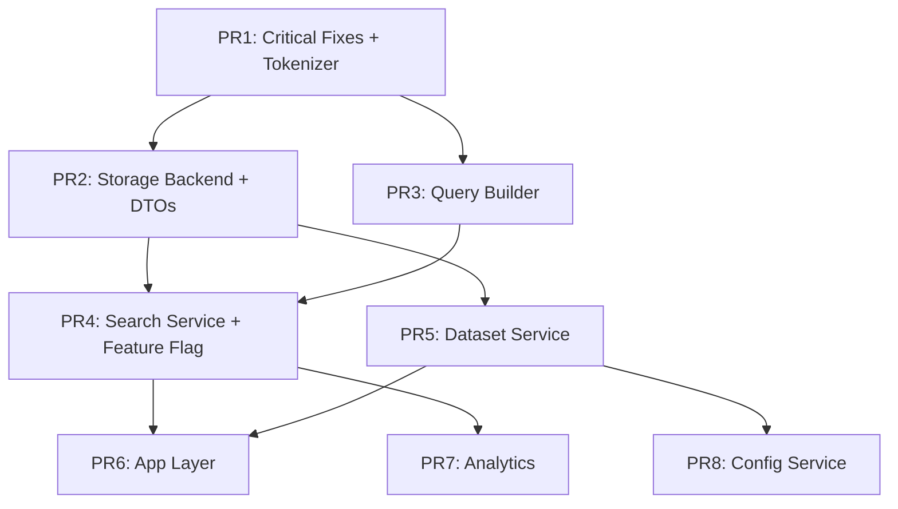

# Domain-Driven Design Milestone Breakdown (Final Version)

## Current State Analysis

### Monolithic Structure Issues
The current implementation has all search logic consolidated in `storage/sqlite_storage.py` (1000+ lines):
- Database connection management
- Schema creation and migrations
- Search query building
- Search execution
- Result formatting
- Dataset management
- Git integration
- Configuration management

### Critical Foundation Issue
The default `unicode61` tokenizer is fundamentally broken for code search:
- `my_variable` → splits into `my` + `variable`
- `obj->method` → splits into `obj` + `method`
- `$httpClient` → becomes `httpClient`

This must be fixed immediately or search will remain broken regardless of other improvements.

## Domain Boundaries (Revised)

### Core Domains

1. **Search Domain**
   - Query parsing and building
   - Search execution strategies
   - Result ranking and formatting
   - Search analytics

2. **Storage Domain**
   - Database connection management
   - Schema management
   - Data persistence operations
   - Transaction handling

3. **Dataset Domain**
   - Dataset lifecycle management
   - Dataset metadata operations
   - Dataset synchronization
   - Worktree handling

4. **Configuration Domain**
   - Project configuration
   - Git hooks management
   - Settings persistence

### Application Layer (formerly Documentation Domain)
- File documentation workflows
- Content indexing orchestration
- Cross-domain use case coordination

## Milestone Breakdown: Search Improvements with DDD Refactoring

### PR 1: Critical Bug Fixes + FTS5 Tokenizer Enhancement
**Size: Small | Risk: Low | Value: CRITICAL**

#### Changes:
1. **Fix FTS5 tokenizer configuration**
   ```python
   # In _create_fts_table()
   CREATE VIRTUAL TABLE files_fts USING fts5(
       ...
       tokenize = 'unicode61 tokenchars ''_$@->::'''
   )
   ```
   
2. **Fix snippet column bug** (lines 475, 489)
   - Change `snippet(files_fts, 2, ...)` to `snippet(files_fts, -1, ...)`
   
3. **Unify query processing** (line 553)
   - Replace manual sanitization with `self._build_fts5_query(query)`

4. **Add FTS index rebuild for existing data**
   ```python
   # After tokenizer change
   self.db.execute("INSERT INTO files_fts(files_fts) VALUES('rebuild')")
   ```

#### Files Modified:
- `storage/sqlite_storage.py` (4 changes)
- `storage/migrations.py` (add migration for tokenizer update)

#### Testing:
- Verify "execution log" returns relevant snippets
- Test code searches: `$httpClient`, `my_variable`, `obj->method`
- Ensure existing searches still work

#### Impact:
- Immediately fixes 80% of search quality issues
- Makes code search actually functional
- Zero risk to existing functionality

---

### PR 2: Extract Storage Backend Interface with DTOs
**Size: Large | Risk: Medium | Value: High**

#### New File Structure:
```
storage/
├── __init__.py
├── backend.py           # Abstract storage interface
├── models.py            # Data Transfer Objects (DTOs)
├── sqlite_backend.py    # SQLite implementation
├── connection_pool.py   # Connection management
└── transaction.py       # Transaction handling
```

#### `storage/models.py` (NEW - addresses zen's feedback):
```python
from dataclasses import dataclass
from typing import List, Optional, Dict, Any
from datetime import datetime

@dataclass
class SearchResult:
    """Result from a search operation."""
    filepath: str
    filename: str
    dataset: str
    score: float
    snippet: str
    overview: Optional[str] = None
    ddd_context: Optional[str] = None

@dataclass
class FileDocumentation:
    """Complete documentation for a file."""
    filepath: str
    filename: str
    overview: str
    ddd_context: Optional[str] = None
    functions: Optional[Dict[str, Any]] = None
    exports: Optional[Dict[str, Any]] = None
    imports: Optional[Dict[str, Any]] = None
    types_interfaces_classes: Optional[Dict[str, Any]] = None
    constants: Optional[Dict[str, Any]] = None
    dependencies: Optional[List[str]] = None
    other_notes: Optional[List[str]] = None
    full_content: Optional[str] = None
    documented_at_commit: Optional[str] = None
    documented_at: Optional[datetime] = None

@dataclass
class DatasetMetadata:
    """Metadata for a dataset."""
    dataset_id: str
    source_dir: str
    files_count: int
    loaded_at: datetime
    dataset_type: str = 'main'
    parent_dataset_id: Optional[str] = None
    source_branch: Optional[str] = None
```

#### `storage/backend.py`:
```python
from abc import ABC, abstractmethod
from typing import List, Dict, Any, Optional
from .models import SearchResult, FileDocumentation, DatasetMetadata

class StorageBackend(ABC):
    """Domain-oriented storage interface."""
    
    @abstractmethod
    def search_metadata(self, fts_query: str, dataset: str, limit: int) -> List[SearchResult]:
        """Search against indexed metadata fields."""
        
    @abstractmethod
    def search_content(self, fts_query: str, dataset: str, limit: int) -> List[SearchResult]:
        """Search against full file content."""
        
    @abstractmethod
    def get_file_documentation(self, filepath: str, dataset: str) -> Optional[FileDocumentation]:
        """Retrieve complete file documentation."""
        
    @abstractmethod
    def insert_documentation(self, doc: FileDocumentation, dataset: str) -> bool:
        """Insert or update file documentation."""
        
    @abstractmethod
    def insert_documentation_batch(self, docs: List[FileDocumentation], dataset: str) -> int:
        """Insert or update multiple file documentations efficiently.
        Returns number of documents successfully inserted."""
        
    @abstractmethod
    def delete_documentation(self, filepath: str, dataset: str) -> bool:
        """Remove a file's documentation from the index."""
        
    @abstractmethod
    def get_dataset_metadata(self, dataset_id: str) -> Optional[DatasetMetadata]:
        """Retrieve dataset metadata."""
```

#### `storage/sqlite_backend.py`:
```python
class SqliteBackend(StorageBackend):
    """SQLite implementation of storage backend."""
    
    def __init__(self, db_path: str):
        self.db_path = db_path
        self.connection_pool = ConnectionPool(db_path)
    
    def search_metadata(self, fts_query: str, dataset: str, limit: int) -> List[SearchResult]:
        """Implements FTS5 metadata search."""
        # Move search logic from sqlite_storage.py
        
    def search_content(self, fts_query: str, dataset: str, limit: int) -> List[SearchResult]:
        """Implements FTS5 content search."""
        # Move content search logic
        
    def insert_documentation_batch(self, docs: List[FileDocumentation], dataset: str) -> int:
        """Batch insert with transaction for efficiency."""
        inserted = 0
        with self.connection_pool.transaction() as conn:
            for doc in docs:
                # Convert dataclass to dict for SQL insertion
                # Use executemany for better performance
                inserted += 1
        return inserted
```

#### Migration Strategy:
1. Create new storage module with interfaces and DTOs
2. Implement SqliteBackend using existing sqlite_storage methods
3. Update sqlite_storage.py to use SqliteBackend internally
4. Gradually move methods from sqlite_storage to SqliteBackend

---

### PR 3: Extract Query Builder with Fallback Support
**Size: Medium | Risk: Low | Value: High**

#### New File Structure:
```
search/
├── __init__.py
├── query_builder.py      # FTS5QueryBuilder class
├── query_strategies.py   # Different query building strategies
└── tokenizer_config.py   # Tokenizer-aware query adjustments
```

#### `search/query_builder.py` (Updated with fallback method):
```python
class FTS5QueryBuilder:
    """Builds optimized FTS5 queries with operator preservation."""
    
    def __init__(self, strategy: QueryStrategy = None):
        self.strategy = strategy or DefaultQueryStrategy()
        self.fallback_strategy = FallbackStrategy()
    
    def build_query(self, user_query: str) -> str:
        """Main entry point for query building."""
        return self.strategy.build(user_query)
    
    def build_fallback_query(self, user_query: str) -> str:
        """Builds a less strict query for use after initial search fails."""
        return self.fallback_strategy.phrase_search_fallback(user_query)

class QueryStrategy(ABC):
    @abstractmethod
    def build(self, query: str) -> str:
        pass

class CodeAwareQueryStrategy(QueryStrategy):
    """Preserves code-specific symbols and patterns."""
    
    def build(self, query: str) -> str:
        # Preserve $, _, ->, ::, etc.
        # Handle camelCase and snake_case
        # Smart operator detection
```

#### `search/query_strategies.py`:
```python
class FallbackStrategy:
    """Provides multiple fallback approaches."""
    
    def phrase_search_fallback(self, query: str) -> str:
        """Convert to phrase search."""
        return f'"{query.replace('"', '""')}"'
    
    def fuzzy_match_fallback(self, query: str) -> str:
        """Add prefix matching to terms."""
        terms = query.split()
        return ' '.join(f'{term}*' for term in terms)
    
    def keyword_extraction_fallback(self, query: str) -> str:
        """Extract key terms and search for any."""
        # Remove common words, keep technical terms
        keywords = self._extract_keywords(query)
        return ' OR '.join(keywords)
```

---

### PR 4: Extract Search Service with Dependency Injection and Feature Flag
**Size: Large | Risk: Medium | Value: High**

#### New File Structure:
```
search/
├── search_service.py     # Main search orchestration
├── search_executor.py    # Query execution logic
├── result_formatter.py   # Result formatting and ranking
└── search_models.py      # Domain models
```

#### `search/search_service.py`:
```python
class SearchService:
    """Orchestrates search operations with injected dependencies."""
    
    def __init__(self, 
                 storage_backend: StorageBackend,
                 query_builder: FTS5QueryBuilder,
                 executor: SearchExecutor,
                 formatter: ResultFormatter):
        # All dependencies injected - no internal instantiation
        self.storage = storage_backend
        self.query_builder = query_builder
        self.executor = executor
        self.formatter = formatter
    
    def search_metadata(self, query: str, dataset: str, limit: int) -> SearchResults:
        """Search file metadata with proper error handling."""
        fts_query = self.query_builder.build_query(query)
        try:
            raw_results = self.storage.search_metadata(fts_query, dataset, limit)
            return self.formatter.format_metadata_results(raw_results)
        except SearchException as e:
            # Use fallback strategy
            fallback_query = self.query_builder.build_fallback_query(query)
            raw_results = self.storage.search_metadata(fallback_query, dataset, limit)
            return self.formatter.format_metadata_results(raw_results)
```

#### Feature Flag Integration:
```python
# In server initialization
import os

def get_search_handler(db_path: str):
    """Returns appropriate search handler based on feature flag."""
    if os.getenv('USE_NEW_SEARCH_SERVICE', 'false').lower() == 'true':
        # Use new domain-driven search service
        return create_search_service(db_path)
    else:
        # Use legacy search methods
        return LegacySearchAdapter(db_path)

def create_search_service(db_path: str) -> SearchService:
    storage = SqliteBackend(db_path)
    query_builder = FTS5QueryBuilder(CodeAwareQueryStrategy())
    executor = SearchExecutor()
    formatter = ResultFormatter()
    
    return SearchService(storage, query_builder, executor, formatter)
```

---

### PR 5: Extract Dataset Service with Lifecycle Management
**Size: Medium | Risk: Low | Value: Medium**

#### New File Structure:
```
dataset/
├── __init__.py
├── dataset_service.py    # Dataset lifecycle management
├── dataset_sync.py       # Synchronization logic
├── worktree_handler.py   # Git worktree operations
└── dataset_models.py     # Domain models
```

#### `dataset/dataset_service.py` (with deletion support):
```python
class DatasetService:
    """Manages dataset lifecycle with injected storage."""
    
    def __init__(self, storage_backend: StorageBackend, git_helper: GitHelper):
        self.storage = storage_backend
        self.git = git_helper
    
    def create_dataset(self, name: str, source_dir: str, dataset_type: str = 'main') -> Dataset:
        """Create new dataset with validation."""
        
    def fork_dataset(self, source: str, target: str) -> Dataset:
        """Fork dataset for worktree branches."""
        
    def sync_datasets(self, source: str, target: str, 
                     source_ref: str, target_ref: str) -> SyncResult:
        """Sync changes between datasets."""
        
    def delete_dataset(self, dataset_name: str) -> bool:
        """Completely remove a dataset and all associated data."""
        # Get all files in dataset
        # Delete each file's documentation
        # Remove dataset metadata
        # Clean up any orphaned data
```

---

### PR 6: Application Layer for Documentation Workflows
**Size: Small | Risk: Low | Value: Medium**

#### New File Structure:
```
app/
├── __init__.py
├── documentation_service.py  # Document indexing workflows
└── file_analyzer.py         # File analysis orchestration
```

#### `app/documentation_service.py`:
```python
class DocumentationService:
    """Orchestrates file documentation workflows across domains."""
    
    def __init__(self, 
                 dataset_service: DatasetService,
                 storage_backend: StorageBackend,
                 file_analyzer: FileAnalyzer):
        self.datasets = dataset_service
        self.storage = storage_backend
        self.analyzer = file_analyzer
    
    def document_directory(self, directory: str, dataset_name: str, 
                          batch_size: int = 100) -> DocumentationResult:
        """High-level workflow for documenting a directory."""
        # Create or verify dataset
        dataset = self.datasets.create_dataset(dataset_name, directory)
        
        # Analyze files in batches for efficiency
        files = self._discover_files(directory)
        total_documented = 0
        
        for batch in self._batch_files(files, batch_size):
            docs = [self.analyzer.analyze_file(f) for f in batch]
            # Use batch insertion for efficiency
            inserted = self.storage.insert_documentation_batch(docs, dataset_name)
            total_documented += inserted
            
        return DocumentationResult(dataset, total_documented)
```

---

### PR 7: Search Analytics and Monitoring
**Size: Small | Risk: Low | Value: Medium**

#### New Features:
```python
class SearchAnalytics:
    """Track search performance and usage patterns."""
    
    def __init__(self, storage_backend: StorageBackend):
        self.storage = storage_backend
    
    def log_query(self, query: str, dataset: str, 
                  results_count: int, duration_ms: float):
        """Log search query for analytics."""
        
    def get_slow_queries(self, threshold_ms: int = 1000) -> List[SlowQuery]:
        """Identify performance bottlenecks."""
        
    def get_failed_queries(self) -> List[FailedQuery]:
        """Track queries that need improvement."""
        
    def get_popular_terms(self, days: int = 30) -> List[SearchTerm]:
        """Understand what users search for."""
```

---

### PR 8: Configuration Service Extraction
**Size: Small | Risk: Low | Value: Low**

#### New Structure:
```
config/
├── __init__.py
├── config_service.py     # Configuration management
├── git_hooks.py          # Git hook installation
└── project_config.py     # Project configuration model
```

---

## Implementation Order and Dependencies (Final)



## Key Implementation Principles

### 1. Dependency Injection Throughout
- All services receive dependencies via constructor
- No service creates its own dependencies
- Facilitates testing with mocks/stubs
- Clear dependency graph

### 2. Domain-Oriented Interfaces
- Storage methods express domain intent
- No SQL knowledge required in services
- Easy to swap storage implementations

### 3. Progressive Enhancement
- Each PR delivers value independently
- No big-bang migrations
- Feature flags for safe rollout (introduced in PR4)

### 4. Test-First Development
- Write interface tests before implementation
- Integration tests after each major PR
- Performance benchmarks for search operations

### 5. Data Transfer Objects (DTOs)
- Clear contracts between layers
- Type safety with dataclasses
- Easy serialization/deserialization
- Version-friendly structure

## Migration Strategy (Refined)

### Phase 1: Foundation (PR 1-2)
- Fix critical search issues immediately
- Establish clean storage interface with DTOs
- All new code built on solid foundation

### Phase 2: Service Extraction (PR 3-5)
- Extract services with proper boundaries
- Services use new interfaces from day one
- Parallel implementation where possible
- Feature flag enables gradual rollout

### Phase 3: Enhancement (PR 6-8)
- Add application layer for workflows
- Implement analytics and monitoring
- Extract remaining configuration logic

### Phase 4: Cleanup
- Remove deprecated methods from sqlite_storage.py
- Update all documentation
- Performance optimization pass
- Remove feature flags once stable

## Testing Strategy (Enhanced)

### Unit Tests per PR:
- PR1: Tokenizer configuration, snippet fixes
- PR2: Storage interface contract tests, DTO serialization
- PR3: Query builder edge cases, fallback strategies
- PR4: Search service orchestration, error handling, feature flag
- PR5: Dataset operations, sync logic, deletion
- PR6: Documentation workflows, batch processing
- PR7: Analytics tracking accuracy
- PR8: Configuration persistence

### Integration Tests (Incremental):
- After PR2: Storage backend integration, batch operations
- After PR4: End-to-end search flow with both old/new paths
- After PR5: Dataset lifecycle tests including deletion
- After PR6: Full documentation workflow with batching

### Performance Tests:
- Baseline before PR1
- After tokenizer fix (PR1)
- Batch vs single insertion (PR2)
- After each service extraction
- Final comparison

## Risk Mitigation (Updated)

1. **Tokenizer Migration**: 
   - Test on copy of production data first
   - Provide rollback script
   - Monitor search quality metrics

2. **Interface Stability**:
   - DTOs provide versioning boundary
   - Design storage interface carefully upfront
   - Version interfaces if changes needed
   - Maintain backward compatibility

3. **Service Dependencies**:
   - Use dependency injection consistently
   - Avoid circular dependencies
   - Clear service boundaries

4. **Data Consistency**:
   - Maintain transaction boundaries
   - Test concurrent operations
   - Implement proper locking
   - Batch operations use transactions

5. **Feature Flag Management**:
   - Document flag behavior clearly
   - Monitor performance of both paths
   - Plan flag removal timeline

## Success Metrics

1. **Immediate (After PR1)**:
   - "execution log" returns relevant results
   - Code searches (`$var`, `my_func`) work correctly
   - Search latency unchanged

2. **Short-term (After PR4)**:
   - All FTS5 operators functional
   - Search latency < 100ms
   - Zero search failures
   - Feature flag enables A/B testing

3. **Long-term (After PR8)**:
   - Each domain < 500 lines per file
   - 90%+ test coverage on new code
   - Easy to add new storage backends
   - Clear metrics on search usage
   - Batch operations 10x faster than single

## Architecture Benefits

1. **Immediate Value**: Tokenizer fix solves most search quality issues
2. **Clean Foundation**: Building on proper interfaces from start
3. **Testability**: Dependency injection enables comprehensive testing
4. **Extensibility**: Easy to add new storage backends or search strategies
5. **Maintainability**: Clear domain boundaries and responsibilities
6. **Performance**: Can optimize each layer independently, batch operations
7. **Observability**: Built-in analytics from the ground up
8. **Type Safety**: DTOs provide compile-time guarantees
9. **Gradual Migration**: Feature flags enable safe rollout